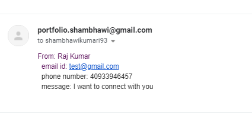
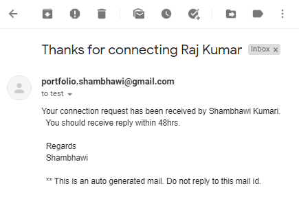

# Portfolio-FS
This website contains details of the author's portfolio. You can navigate to various section to view projects, github link, linkedIn link and connect with the auther using Contact page. Node mailer is used to send email to the author and also send acknowledgement mail to sender.
While navigating through the page, you might find three tabs :

```
This is how the application works in Desktop view.
```
  

```
The application in mobile screen size
```
 

```
When the user fills contact me form, following mail is sent to author's mail id:
```
 

 ```
When the user fills contact me form, following mail is sent as acknowledgement to the sender:
```
 


## Technologies Used
- NodeJs - server side technology
- ExpressJs
- Node-mailer
- HTML - used to create elements on the DOM
- CSS - styles html elements on page
- Materialize - CSS framework
- Git - version control system to track changes to source code
- GitHub - hosts repository that can be deployed to GitHub Pages


## Deployed Link

[Live Hosted on](https://shambhawi-8e4606f2bf38.herokuapp.com/)

## Authors

* **Shambhawi Kumari**
 - [GitHub](https://github.com/shambhawi13/) | 
 - [LinkedIn](https://www.linkedin.com/in/shambhawi-kumari/)


## Review URL

- [GitHub](https://github.com/shambhawi13/Portfolio-FS)
- [GitHeroku](https://git.heroku.com/portfolio-shambhawi)
- [Live](https://portfolio-shambhawi.herokuapp.com/)


